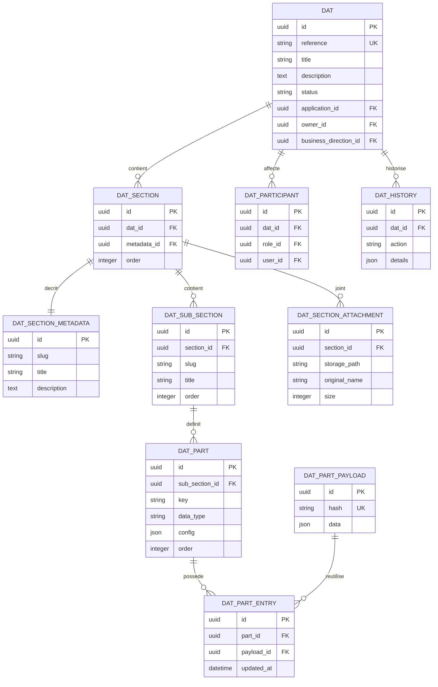

<!--
SPDX-FileCopyrightText: 2026 Cintamaya <contact@cintamaya.com>
SPDX-FileCopyrightText: 2026 Baptiste COQUELET <github.com/BaptisteCoquelet>
SPDX-License-Identifier: CC-BY-ND-4.0
-->

# Stockage des données d'un DAT

**Public visé :** développeurs, exploitants PostgreSQL et personnes responsables des exports DAT.
**Objectif :** expliquer où et comment CintaFactory stocke le contenu d'un Dossier d'Architecture Technique (DAT), y compris les références draw.io et LikeC4.
**Sources de vérité :** `cintafactory/dat/models.py`, `cintafactory/dat/sections.py`, `cintafactory/dat/exporters.py`, `cintafactory/dat/importers.py`, `cintafactory/diagrams/models.py` et les migrations Django.
**Dernière vérification :** 25 septembre 2026.

## 1. Résumé

Le contenu d'un DAT est normalisé dans PostgreSQL. Il n'est pas stocké dans une seule colonne JSON du modèle `DAT`.

La valeur d'un champ suit cette chaîne :

```text
dat_dat
└── dat_section
    └── dat_sub_section
        └── dat_part                 définition du champ
            └── dat_part_entry       association champ / valeur
                └── dat_part_payload.data  valeur réelle en JSON
```

Le modèle `DAT` porte l'identité et les métadonnées globales. Les champs métier sont des `DATPart` et leurs valeurs sont stockées dans `DATPartPayload.data`, référencé par `DATPartEntry`.

Les fichiers binaires ne sont pas stockés dans PostgreSQL : les pièces jointes, les fichiers XML draw.io et les fichiers `.c4` LikeC4 sont déposés dans SeaweedFS. PostgreSQL conserve leurs métadonnées et leurs chemins de stockage.

## 2. Modèle relationnel



Le diagramme présente les données principales. Les tables d'affectation des responsables, participants de section, administrateurs DAT, réserves et autorisations d'export sont liées au DAT mais ne contiennent pas le texte métier des sections.

## 3. Table racine : `dat_dat`

Modèle Django : `cintafactory/dat/models.py`, classe `DAT`.

Table SQL : `dat_dat`.

Champs principaux :

| Champ | Rôle |
| --- | --- |
| `id` | UUID primaire du DAT. |
| `reference` | Référence métier unique. C'est l'identifiant le plus pratique pour les recherches humaines. |
| `title` | Titre du DAT. |
| `description` | Description générale du DAT. |
| `application_id` | Application concernée, relation protégée vers `dat_application`. |
| `status` | Statut global du DAT. |
| `owner_id` | Propriétaire du DAT. |
| `business_direction_id` | Direction métier, resynchronisée depuis l'application lors de `DAT.save()`. |
| `created_at`, `updated_at` | Dates de création et de modification de la ligne racine. |
| `pdf_export_*` | État et métadonnées de l'export PDF, pas le contenu fonctionnel du DAT. |

La suppression d'une application ou d'une direction métier référencée est protégée par la base et Django. La suppression du DAT entraîne la suppression en cascade de plusieurs données dépendantes, notamment les sections, champs et historiques.

## 4. Structure du document

### 4.1 Sections

`DATSection` est la relation entre un DAT et une section. Elle contient l'ordre et les rôles autorisés. Le titre, le slug et la description sont dans `DATSectionMetadata`, table nommée `dat_section_metada`.

> `dat_section_metada` contient volontairement le suffixe `metada` : c'est le nom SQL défini par le modèle et les migrations actuels. Il ne faut pas le renommer sans migration de données.

Tables :

- `dat_section` : `dat_id`, `metadata_id`, `order` ;
- `dat_section_metada` : `slug`, `title`, `description` ;
- tables automatiques Django pour les rôles autorisés ;
- `dat_sub_section` : sous-sections rattachées à `section_id`.

### 4.2 Sous-sections

`DATSubSection` décrit une sous-section :

- `section_id` : section parente ;
- `slug` : identifiant stable dans le DAT ;
- `title`, `description` : présentation ;
- `order` : ordre d'affichage ;
- `allowed_roles` : configuration de responsabilité, pas valeur métier.

La paire `(section_id, slug)` est unique.

### 4.3 Définitions de champs : `dat_part`

`DATPart` définit un champ de formulaire. Il ne stocke pas directement la valeur saisie.

| Champ | Rôle |
| --- | --- |
| `sub_section_id` | Sous-section parente. |
| `key` | Identifiant technique stable du champ. |
| `label` | Libellé affiché. |
| `data_type` | Type logique du champ. |
| `required` | Indique si le champ est obligatoire. |
| `order` | Ordre d'affichage. |
| `config` | Configuration JSON : choix, colonnes de repeater, nombre de lignes, règles d'affichage, etc. |

La paire `(sub_section_id, key)` est unique.

Les définitions initiales viennent de `cintafactory/dat/config/section_blueprints.json`. À la création d'un DAT, `ensure_default_sections()` crée les sections, sous-sections et champs en base. `sync_dat_sections_if_needed()` compare ensuite la structure aux blueprints et la resynchronise si nécessaire.

La synchronisation peut supprimer une sous-section ou un champ qui n'existe plus dans le blueprint. Comme cette suppression entraîne celle des valeurs dépendantes, toute modification de `section_blueprints.json` doit être traitée comme une migration de données.

## 5. Stockage des valeurs

### 5.1 `dat_part_entry`

`DATPartEntry` associe un champ (`part_id`) à un payload (`payload_id`). Il contient notamment :

- `part_id` ;
- `payload_id`, nullable pour une valeur vide ;
- `created_at` ;
- `updated_at`.

Il n'existe pas de colonne `value` dans cette table.

Le code charge les entrées d'un champ avec l'ordre `updated_at DESC, id DESC`. La première entrée est considérée comme la valeur courante. En pratique, une modification met à jour l'entrée courante ; la structure permet toutefois plusieurs entrées, notamment pour compatibilité avec des données existantes.

### 5.2 `dat_part_payload`

`DATPartPayload` contient la valeur réelle :

| Champ | Rôle |
| --- | --- |
| `id` | UUID du payload. |
| `hash` | SHA-256 du JSON normalisé, unique et indexé. |
| `data` | Valeur JSON/JSONB : chaîne, nombre, booléen, objet ou liste. |
| `created_at` | Date de création du payload. |

Le payload est dédupliqué : `get_or_create_for_value()` normalise la valeur, calcule son hash et réutilise un payload existant si le hash est déjà présent. Les payloads sont conçus comme immuables : une modification crée ou réutilise un autre payload et déplace la référence de `DATPartEntry`.

Le hash sert à la déduplication ; il ne chiffre pas le contenu.

### 5.3 Types et représentation

| `data_type` | Représentation habituelle dans `dat_part_payload.data` |
| --- | --- |
| `text`, `long_text`, `url` | Chaîne JSON. |
| `integer` | Nombre entier JSON. |
| `decimal` | Chaîne décimale normalisée pour éviter les pertes de précision. |
| `date` | Date au format ISO, par exemple `2026-09-25`. |
| `boolean` | Booléen JSON. |
| `json` | Objet ou liste JSON libre. |
| `repeater` | Liste d'objets JSON, une ligne par élément du tableau. |

Exemple conceptuel :

```json
{
  "key": "raison_etre",
  "data_type": "long_text",
  "value": "Centraliser les commandes clients."
}
```

Pour un repeater :

```json
[
  {
    "version": "V1",
    "date_validation": "2026-09-25",
    "responsable": "Alice Martin"
  },
  {
    "version": "V2",
    "date_validation": "2026-10-02",
    "responsable": "Bob Dupont"
  }
]
```

Le champ `config` de `dat_part` décrit les colonnes et contraintes du repeater ; les lignes saisies sont dans `dat_part_payload.data`.

## 6. Cycle d'écriture d'une valeur

Lorsqu'un utilisateur enregistre une sous-section :

1. `DATSubSectionForm` récupère la valeur du formulaire ;
2. `DATPart.prepare_value()` la convertit selon `data_type` ;
3. `DATPart.update_value()` demande un payload via `DATPartPayload.get_or_create_for_value()` ;
4. une entrée `DATPartEntry` est créée si aucune entrée courante n'existe ;
5. sinon, l'entrée courante reçoit le nouveau `payload_id` et `updated_at` est actualisé ;
6. une entrée `dat_history` de type `section_updated` enregistre le changement affiché.

Le formulaire n'écrit pas les champs directement dans `dat_dat`. Les valeurs sont donc indépendantes de la ligne racine et sont accessibles par la hiérarchie des relations.

## 7. Draw.io et LikeC4 dans un DAT

### 7.1 Référence dans le contenu DAT

Les schémas sont généralement stockés dans le repeater `architecture/schemas`. Une ligne contient notamment :

| Champ | Draw.io | LikeC4 |
| --- | --- | --- |
| `nom_schema` | Nom lisible. | Nom lisible. |
| `schema_systeme` | `drawio`. | `likec4`. |
| `diagramme_id` | UUID de `DrawIODiagram`. | Vide. |
| `schema_reference` | Facultatif. | Chemin SeaweedFS terminant par `.c4`. |
| `description` | Contexte facultatif. | Contexte facultatif. |

Cette ligne est une valeur JSON dans `dat_part_payload.data`. Il n'y a pas de clé étrangère directe entre `dat_dat` et `DrawIODiagram` ou `LikeC4Diagram`.

### 7.2 Fichier XML draw.io

Modèle Django : `cintafactory/diagrams/models.py`, classe `DrawIODiagram`.

Table : `diagrams_diagram`.

PostgreSQL conserve :

- UUID `id` ;
- `title` ;
- nom du fichier `xml_file` ;
- `xml_content_type` et `xml_size` ;
- nom, type et taille de la miniature ;
- `owner_id` ;
- dates de création et de modification.

Le contenu XML lui-même est envoyé à `SeaweedFSStorage`. Le chemin est construit sous la forme `diagrams/<uuid>/diagram.drawio`. La miniature est également externe, sous `diagrams/<uuid>/views/thumb.png`.

### 7.3 Fichier LikeC4

Modèle Django : classe `LikeC4Diagram`.

Table : `diagrams_likec4file`.

PostgreSQL conserve le chemin unique `storage_path`, le type, la taille du fichier `.c4` et les métadonnées de l'export PNG. Le fichier source et la miniature sont dans SeaweedFS.

### 7.4 Résultat de l'analyse des diagrammes

Le parseur extrait les composants et relations des sources draw.io/LikeC4. Les résultats sont réécrits dans les repeaters DAT :

- sous-section `briques-techniques`, champ `briques` ;
- sous-section `flux`, champ `flux`.

Ces données sont donc elles aussi stockées dans `dat_part_payload.data` sous forme de listes JSON. La génération remplace entièrement les tableaux `briques` et `flux` ; elle ne fusionne pas les lignes manuelles existantes.

Référence détaillée : [`docs/FluxApplicatifs.md`](FluxApplicatifs.md).

## 8. Pièces jointes

Modèle : `DATSectionAttachment`.

Table : `dat_section_attachment`.

La base contient :

- `section_id` ;
- `storage_path` ;
- nom original et nom affiché ;
- extension, taille et type MIME ;
- utilisateur déposant ;
- date de création.

Le contenu binaire est enregistré dans SeaweedFS avec un chemin de type :

```text
dat_attachments/<dat_id>/<section_slug>/<uuid>_<nom-fichier>
```

Lire la ligne SQL sans lire l'objet SeaweedFS ne permet donc pas de récupérer le fichier lui-même.

## 9. Historique et versioning

### `dat_history`

`DATHistory` conserve :

- le DAT concerné ;
- l'action (`created`, `updated`, `status_changed`, `section_updated`, etc.) ;
- l'acteur ;
- `details` en JSON ;
- la date.

Lors d'une modification de sous-section, `details.changes` contient généralement les valeurs d'affichage `from` et `to` pour les champs modifiés.

### Limite importante

Le système ne conserve pas une photographie complète du DAT à chaque modification. `dat_history` est un journal de changements, pas une table de versions complètes.

`DATPartPayload` peut conserver des payloads historiques ou partagés, mais il ne suffit pas à reconstruire de manière fiable la structure complète, les permissions, les pièces jointes et les références du DAT à une date donnée.

## 10. Requêtes SQL d'inspection

Les requêtes suivantes sont en lecture seule. Utiliser un paramètre lié pour la référence du DAT ; ne pas concaténer une valeur fournie par un utilisateur.

### 10.1 Lire tous les champs et leurs valeurs courantes

```sql
SELECT
    d.reference,
    sm.slug AS section_slug,
    sm.title AS section_title,
    ss.slug AS sub_section_slug,
    ss.title AS sub_section_title,
    p.key,
    p.label,
    p.data_type,
    p.config,
    pp.data AS value,
    e.updated_at AS value_updated_at
FROM dat_dat AS d
JOIN dat_section AS s
  ON s.dat_id = d.id
JOIN dat_section_metada AS sm
  ON sm.id = s.metadata_id
JOIN dat_sub_section AS ss
  ON ss.section_id = s.id
JOIN dat_part AS p
  ON p.sub_section_id = ss.id
LEFT JOIN LATERAL (
    SELECT e1.*
    FROM dat_part_entry AS e1
    WHERE e1.part_id = p.id
    ORDER BY e1.updated_at DESC, e1.id DESC
    LIMIT 1
) AS e ON TRUE
LEFT JOIN dat_part_payload AS pp
  ON pp.id = e.payload_id
WHERE d.reference = $1
ORDER BY s."order", ss."order", p."order";
```

Cette requête retourne une ligne par champ. Un champ vide aura `NULL` dans `value` si aucune entrée ou aucun payload n'est associé.

### 10.2 Lire uniquement les données de diagrammes et de flux

```sql
SELECT
    d.reference,
    sm.slug AS section_slug,
    ss.slug AS sub_section_slug,
    p.key,
    pp.data AS value
FROM dat_dat AS d
JOIN dat_section AS s
  ON s.dat_id = d.id
JOIN dat_section_metada AS sm
  ON sm.id = s.metadata_id
JOIN dat_sub_section AS ss
  ON ss.section_id = s.id
JOIN dat_part AS p
  ON p.sub_section_id = ss.id
JOIN LATERAL (
    SELECT e1.*
    FROM dat_part_entry AS e1
    WHERE e1.part_id = p.id
    ORDER BY e1.updated_at DESC, e1.id DESC
    LIMIT 1
) AS e ON TRUE
JOIN dat_part_payload AS pp
  ON pp.id = e.payload_id
WHERE d.reference = $1
  AND p.key IN ('schemas', 'briques', 'flux');
```

Pour filtrer les lignes JSON côté PostgreSQL, vérifier d'abord la forme réelle de `pp.data`. Les clés de repeater sont des données applicatives et peuvent évoluer avec les blueprints.

### 10.3 Lire les pièces jointes

```sql
SELECT
    d.reference,
    sm.slug AS section_slug,
    a.original_name,
    a.display_name,
    a.storage_path,
    a.content_type,
    a.size,
    a.created_at
FROM dat_dat AS d
JOIN dat_section AS s
  ON s.dat_id = d.id
JOIN dat_section_metada AS sm
  ON sm.id = s.metadata_id
JOIN dat_section_attachment AS a
  ON a.section_id = s.id
WHERE d.reference = $1
ORDER BY a.created_at DESC;
```

## 11. Export et import

L'export JSON ne lit pas une colonne globale. `DATExportModelBuilder` reconstruit la hiérarchie :

```text
dat
application
owner
participants
sections
  └── sub_sections
        └── parts
              └── value
```

Pour chaque `DATPart`, l'export lit `part.value`, donc le payload courant, puis expose cette valeur sous `parts[].value`.

L'import suit les identifiants fonctionnels :

1. `section.slug` ;
2. `sub_section.slug` ;
3. `part.key`.

Il prépare ensuite la valeur selon le type du champ et appelle `part.update_value()`. Un export JSON constitue donc un format d'échange ; ce n'est pas la représentation physique d'une seule table.

## 12. Règles à retenir

- Chercher les valeurs dans `dat_part_payload.data`, pas dans `dat_dat`.
- Relier les valeurs à leur sens métier via `dat_part.key`, `dat_sub_section.slug` et `dat_section_metada.slug`.
- Ne pas interpréter `dat_part.config` comme la valeur saisie : c'est la définition du champ.
- Utiliser la dernière `dat_part_entry` par `updated_at` pour obtenir la valeur courante.
- Draw.io et LikeC4 sont référencés depuis un repeater DAT, mais leurs fichiers sont stockés hors PostgreSQL.
- Les pièces jointes sont également externes ; la DB conserve leur chemin et leurs métadonnées.
- L'historique détaille les changements, sans fournir de version complète restaurable.
- Préférer l'ORM Django ou les services d'import/export pour les écritures ; une écriture SQL directe doit préserver les UUID, les clés étrangères, le hash des payloads et les invariants de structure.

## 13. Personnaliser le modèle DAT

Le modèle DAT est personnalisable à plusieurs niveaux. Le bon niveau dépend de la nature du changement :

| Besoin | Point d’extension |
|---|---|
| Ajouter une section, une sous-section ou un champ métier | Blueprint JSON |
| Ajouter une propriété transverse au DAT | Modèle Django `DAT` + formulaire/API/export/import |
| Ajouter un type de champ réutilisable | Enum, formulaire, préparation/rendu des valeurs et tests |
| Ajouter un diagramme spécialisé | Configuration du blueprint + logique de parsing/rendu |

### 13.1 Modifier le blueprint JSON

Le blueprint par défaut est versionné dans `cintafactory/dat/config/section_blueprints.json`. En environnement installé, la copie active est `cintafactory/conf/section_blueprints.json` : elle est prioritaire si elle existe et doit être conservée dans le volume persistant. Un changement de blueprint nécessite donc de modifier la copie réellement chargée, puis de redémarrer les processus qui ont déjà importé la configuration.

La structure logique est :

```text
section
└── parts       (sous-sections DAT)
    └── entries (champs DAT)
```

Chaque section et sous-section doit conserver un `slug` stable, et chaque champ doit conserver une `key` stable. Ces identifiants servent à retrouver la valeur dans les entrées du DAT, les exports/imports et certaines règles métier. Le `label` peut évoluer sans changer ces clés.

Exemple minimal :

```json
[
  {
    "slug": "securite",
    "label": "Sécurité",
    "description": "Informations de sécurité du produit",
    "parts": [
      {
        "slug": "classification",
        "label": "Classification",
        "entries": [
          {
            "key": "niveau-confidentialite",
            "label": "Niveau de confidentialité",
            "type": "text",
            "choices": [
              {"value": "public", "label": "Public"},
              {"value": "interne", "label": "Interne"},
              {"value": "confidentiel", "label": "Confidentiel"}
            ],
            "required": true,
            "order": 10
          }
        ]
      }
    ]
  }
]
```

Dans le code, `parts` représente historiquement les sous-sections (`DATSubSection`) et `entries` les définitions de champs (`DATPartEntry`). La synchronisation est idempotente : les objets existants sont réutilisés par leurs slugs/clés et les champs manquants sont créés.

### 13.2 Ajouter un champ métier

Procédure recommandée :

1. Choisir un `slug` de section et de sous-section stable.
2. Ajouter une entrée avec une clé technique unique dans sa sous-section.
3. Choisir un type supporté et compléter sa configuration.
4. Définir `label`, `description`, `required`, `order` et, si besoin, `allowed_roles`.
5. Redémarrer l’application ou déclencher le chemin applicatif qui appelle la synchronisation.
6. Ouvrir un DAT de test et vérifier saisie, lecture, export et import.

Les types actuellement interprétés par le formulaire DAT sont `text`, `long_text`, `integer`, `decimal`, `date`, `boolean`, `json`, `url` et `repeater`. Les champs à choix utilisent `choices`; `widget` peut sélectionner notamment `radio`, `checkbox` ou `checkboxes`, et `multiple` active la sélection multiple.

Options importantes :

- `text` : `max_length`, `pattern`, `pattern_message` ;
- `long_text` : `rows` ;
- `decimal` : `max_digits`, `decimal_places` ;
- `repeater` : `columns`, `min_rows`, `max_rows`, `allow_row_addition`, `allow_row_removal` ;
- diagramme Draw.io : `render: "drawio_diagram"`, `drawio: true`, `drawio_name_key` et, si nécessaire, `drawio_allow_import`.

`allowed_roles` restreint l’édition du champ aux rôles prévus. Ce contrôle doit rester cohérent avec les autorisations serveur : masquer un champ dans l’interface ne remplace jamais une vérification d’autorisation côté serveur.

### 13.3 Faire évoluer ou supprimer un champ

Changements généralement sûrs :

- modifier le `label`, la description ou l’ordre ;
- ajouter des choix en conservant les valeurs déjà utilisées ;
- augmenter une limite de longueur ;
- ajouter une nouvelle sous-section ou un nouveau champ.

Changements à traiter comme une migration :

- renommer un `slug` ou une `key` ;
- supprimer un champ, une sous-section ou une section ;
- changer le type d’un champ ;
- modifier la forme d’un JSON ou les colonnes d’un `repeater` ;
- supprimer ou renommer la valeur d’un choix déjà enregistré.

La synchronisation supprime les entrées et sous-sections qui ne sont plus présentes dans le blueprint. Une suppression de définition peut donc rendre les données correspondantes inaccessibles ou les supprimer selon le chemin de synchronisation. Avant une suppression, exporter les DAT concernés et vérifier les dépendances dans les vues, règles métier, imports, exports et tests.

Pour renommer une clé, utiliser une migration explicite :

1. sauvegarder/exporter les données ;
2. ajouter la nouvelle clé sans supprimer l’ancienne ;
3. convertir ou recopier les valeurs existantes ;
4. adapter les lecteurs, écritures, imports et exports ;
5. vérifier les résultats ;
6. supprimer l’ancienne clé seulement après la période de compatibilité.

Il n’y a pas de conversion automatique fiable entre types. Par exemple, passer de `text` à `repeater` exige de définir la transformation des valeurs existantes et son comportement pour les valeurs invalides.

### 13.4 Ajouter une donnée structurelle au modèle Django

Utiliser le blueprint JSON tant que la donnée est un champ DAT configurable. Modifier le modèle Django `DAT` seulement lorsqu’il s’agit d’un attribut structurel, transverse et stable : relation, état technique, identifiant externe, métadonnée d’intégration, etc.

Pour ce changement, mettre à jour ensemble :

- le modèle et sa migration ;
- les formulaires, serializers/API et vues ;
- les permissions et contrôles d’accès ;
- l’admin si elle est utilisée ;
- l’export/import ;
- l’historique ou l’audit si la donnée doit être historisée ;
- les tests de création, modification et lecture.

Créer ensuite la migration avec `python manage.py makemigrations dat`, la relire, puis l’appliquer avec `python manage.py migrate`. Une nouvelle table est préférable lorsque la donnée est répétée, volumineuse, relationnelle ou possède son propre cycle de vie ; éviter de stocker dans un champ JSON une structure qui doit être filtrée, référencée ou contrainte par la base.

### 13.5 Ajouter un nouveau type de champ

Un nouveau type ne se limite pas à ajouter une valeur dans `DATPartEntryType`. Il faut couvrir tout le cycle :

1. ajouter le type dans l’enum du modèle ;
2. définir sa configuration JSON ;
3. construire son widget dans `build_dat_part_field()` ;
4. gérer validation et normalisation dans `DATPart.prepare_value()` ;
5. gérer affichage dans `render_value()` et valeur initiale ;
6. vérifier sauvegarde, export, import et historique ;
7. ajouter les tests du formulaire et du stockage.

La valeur persistée doit rester sérialisable et compatible avec le format attendu par `dat_part_payload.data`. Si le type référence un fichier, un diagramme ou une ressource externe, stocker une référence stable et les métadonnées nécessaires plutôt que dépendre d’un chemin local ou d’un état d’interface.

### 13.6 Règles particulières pour les workflows et diagrammes

Certaines sections ne sont pas purement déclaratives. Les vues appliquent des règles sur des slugs connus : par exemple, le rôle responsable de `architecture` et `cybersecurite` est forcé, et la section architecture attend les sous-sections `schemas`, `briques-techniques` et `flux` avec les clés de repeater correspondantes.

Avant de renommer ces identifiants, rechercher leurs usages dans `cintafactory/dat/` et adapter simultanément :

- les constantes et règles d’affectation ;
- les parsers de diagrammes ;
- les boutons et actions d’import ;
- la validation des lignes de repeater ;
- l’affichage et l’export.

Pour un nouveau diagramme Draw.io ou LikeC4, le blueprint décrit le champ et ses métadonnées, mais le comportement complet peut nécessiter du code : format du contenu, validation, stockage externe, rendu, import/export et gestion des erreurs. Tester à la fois la création, la modification, la réouverture et l’export du diagramme.

### 13.7 Déploiement et stratégie de test

Pour une modification de modèle DAT :

1. sauvegarder la base et exporter un jeu de DAT représentatif ;
2. modifier le blueprint ou le code ;
3. valider le JSON et vérifier la copie runtime chargée ;
4. lancer la synchronisation sur un environnement de test ;
5. contrôler le nombre de sections, sous-sections, champs et valeurs ;
6. appliquer les migrations si le modèle Django change ;
7. redémarrer les workers/web concernés ;
8. exécuter les tests DAT et vérifier un export/import.

La synchronisation n’est pas une commande globale dédiée : elle est appelée à la demande par plusieurs chemins applicatifs. Pour un déploiement reproductible, utiliser un script ou une commande Django idempotente qui charge explicitement le blueprint, vérifie ses invariants et journalise les créations/suppressions. Ne pas exécuter une synchronisation destructive directement en production sans sauvegarde et comparaison préalable.

Checklist minimale :

- slugs et clés stables ;
- valeurs existantes conservées ;
- permissions testées ;
- formulaire validé ;
- payload et historique vérifiés ;
- export/import vérifiés ;
- diagrammes testés si concernés ;
- migration relue si le modèle Django a changé.

## 14. Fichiers de référence

- [`cintafactory/dat/models.py`](../cintafactory/dat/models.py) — modèles et tables DAT.
- [`cintafactory/dat/sections.py`](../cintafactory/dat/sections.py) — création et synchronisation des sections.
- [`cintafactory/dat/config/section_blueprints.json`](../cintafactory/dat/config/section_blueprints.json) — définition des sections et champs.
- [`cintafactory/dat/forms.py`](../cintafactory/dat/forms.py) — conversion et sauvegarde des valeurs de formulaire.
- [`cintafactory/dat/exporters.py`](../cintafactory/dat/exporters.py) — reconstruction du DAT pour les exports.
- [`cintafactory/dat/importers.py`](../cintafactory/dat/importers.py) — import depuis le JSON exporté.
- [`cintafactory/dat/attachments.py`](../cintafactory/dat/attachments.py) — stockage des pièces jointes.
- [`cintafactory/diagrams/models.py`](../cintafactory/diagrams/models.py) — modèles draw.io et LikeC4.
- [`cintafactory/cintafactory/storage/seaweedfs_storage.py`](../cintafactory/cintafactory/storage/seaweedfs_storage.py) — stockage objet SeaweedFS.
- [`docs/FluxApplicatifs.md`](FluxApplicatifs.md) — extraction des briques et flux depuis draw.io/LikeC4.
